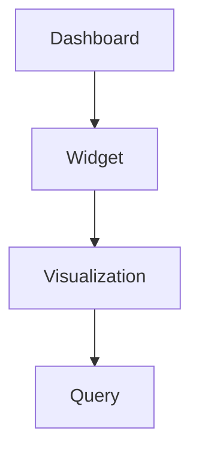

# Redash Dashboard JSON Schema

**Version:** v10.1.0
**Date:** 2023-11-02

This document provides a detailed description of the JSON structure used by the Redash Dashboards API. It includes a breakdown of all fields, their data types, and their relationships.

## Relational Diagram

The following diagram illustrates the relationship between the main objects in the dashboard structure:



## Field Descriptions

The following tables describe the fields found in the JSON representation of a dashboard and its nested objects.

### Dashboard Object

The root object representing a dashboard.

| Path JSON | Type | Required | Description | Example |
|---|---|---|---|---|
| `id` | integer | Yes | The unique identifier for the dashboard. | `123` |
| `slug` | string | Yes | The URL-friendly slug for the dashboard. | `"sales-dashboard"` |
| `name` | string | Yes | The display name of the dashboard. | `"Sales Dashboard"` |
| `user_id` | integer | Yes | The ID of the user who created the dashboard. | `1` |
| `user` | object | Yes | An object containing details about the creator. | `{"id": 1, "name": "Admin"}` |
| `layout` | array | Yes | An array defining the layout of widgets on the dashboard. See the "Layout Structure" section for details. | `[[456, 457], [458]]` |
| `dashboard_filters_enabled` | boolean | Yes | A flag indicating if dashboard-level filters are enabled. | `true` |
| `widgets` | array | No | An array of widget objects. Only present on `GET /api/dashboards/<slug>`. | `[...]` |
| `options` | object | Yes | A dictionary for dashboard-level options. | `{}` |
| `is_archived` | boolean | Yes | A flag indicating if the dashboard is archived. | `false` |
| `is_draft` | boolean | Yes | A flag indicating if the dashboard is a draft. | `false` |
| `tags` | array | No | A list of tags associated with the dashboard. | `["sales", "kpi"]` |
| `updated_at` | string | Yes | The ISO 8601 timestamp of the last update. | `"2023-11-01T12:00:00.000Z"` |
| `created_at` | string | Yes | The ISO 8601 timestamp of the creation date. | `"2023-11-01T10:00:00.000Z"` |
| `version` | integer | Yes | The version number of the dashboard. | `2` |
| `is_favorite`| boolean | No | Indicates if the dashboard is favorited by the current user. | `true` |

### Layout Structure

The `layout` field is an array of arrays, where each inner array represents a row on the dashboard. The numbers within the inner arrays are the IDs of the widgets to be displayed in that row.

For example, the following layout:

```json
"layout": [
  [456, 457],
  [458]
]
```

...would result in a dashboard with two rows. The first row would contain widgets with IDs `456` and `457`, and the second row would contain the widget with ID `458`.

### Widget Object

Represents a single widget within a dashboard. There are two main types of widgets: **Visualization** and **Textbox**.

| Path JSON | Type | Required | Description | Example |
|---|---|---|---|---|
| `id` | integer | Yes | The unique identifier for the widget. | `456` |
| `width` | integer | Yes | The width of the widget. | `1` |
| `options` | object | Yes | A dictionary for widget-specific options. | `{}` |
| `dashboard_id` | integer | Yes | The ID of the dashboard this widget belongs to. | `123` |
| `text` | string | No | The text content, if the widget is a textbox. | `"This is a note."` |
| `visualization` | object | No | The visualization object, if the widget displays a visualization. For a more detailed description of the Visualization object and its API, please see the [Redash Visualization JSON Schema](./visualizations_schema.md). | `{...}` |
| `updated_at` | string | Yes | The ISO 8601 timestamp of the last update. | `"2023-11-01T12:00:00.000Z"` |
| `created_at` | string | Yes | The ISO 8601 timestamp of the creation date. | `"2023-11-01T10:00:00.000Z"` |

#### Visualization Widget

A Visualization widget is used to display a query result in a graphical format (e.g., a chart or a table). It is identified by the presence of a `visualization` object. The `text` field will be `null`.

#### Textbox Widget

A Textbox widget is used to display arbitrary text on the dashboard. It is identified by the presence of a `text` string. The `visualization` field will be `null`.

### Visualization Object

Represents a visualization, which is linked to a query. For a more detailed description of the Visualization object and its API, please see the [Redash Visualization JSON Schema](./visualizations_schema.md).

| Path JSON | Type | Required | Description | Example |
|---|---|---|---|---|
| `id` | integer | Yes | The unique identifier for the visualization. | `789` |
| `type` | string | Yes | The type of visualization (e.g., `CHART`, `TABLE`). | `"TABLE"` |
| `name` | string | Yes | The name of the visualization. | `"Sales Over Time"` |
| `description` | string | No | A description of the visualization. | `"A chart showing sales trends."` |
| `options` | object | Yes | A dictionary for visualization-specific options. | `{}` |
| `query` | object | Yes | The query object that provides data for this visualization. | `{...}` |
| `updated_at` | string | Yes | The ISO 8601 timestamp of the last update. | `"2023-11-01T12:00:00.000Z"` |
| `created_at` | string | Yes | The ISO 8601 timestamp of the creation date. | `"2023-11-01T10:00:00.000Z"` |

### Query Object

Represents a query that is linked to a visualization. For a more detailed description of the Query object and its API, please see the [Redash Query JSON Schema](./queries_schema.md).

| Path JSON | Type | Required | Description | Example |
|---|---|---|---|---|
| `id` | integer | Yes | The unique identifier for the query. | `101` |
| `name` | string | Yes | The name of the query. | `"Get Sales Data"` |
| `description` | string | No | A description of the query. | `"Retrieves sales data from the transactions table."` |
| `query` | string | Yes | The SQL query text. | `"SELECT * FROM sales;"` |
| `query_hash` | string | Yes | A hash of the query text. | `"a1b2c3d4..."` |
| `is_archived` | boolean | Yes | A flag indicating if the query is archived. | `false` |
| `is_draft` | boolean | Yes | A flag indicating if the query is a draft. | `false` |
| `data_source_id` | integer | Yes | The ID of the data source this query belongs to. | `1` |
| `options` | object | Yes | A dictionary for query-specific options. | `{}` |
| `updated_at` | string | Yes | The ISO 8601 timestamp of the last update. | `"2023-11-01T12:00:00.000Z"` |
| `created_at` | string | Yes | The ISO 8601 timestamp of the creation date. | `"2023-11-01T10:00:00.000Z"` |
