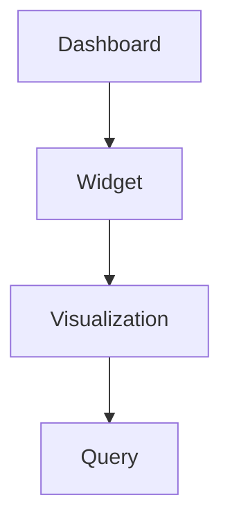

# Redash Dashboard JSON Schema

**Version:** v25.8.0 (August 2025)
**Date:** 2025-08-01

This document provides a detailed description of the JSON structure used by the Redash Dashboards API. It includes a breakdown of all fields, their data types, and their relationships.

## Relational Diagram

The following diagram illustrates the relationship between the main objects in the dashboard structure:



## Field Descriptions

The following tables describe the fields found in the JSON representation of a a dashboard and its nested objects.

### Dashboard Object

The root object representing a dashboard.

| Path JSON | Type | Required | Description | Example |
|---|---|---|---|---|
| `id` | integer | Yes | The unique identifier for the dashboard. | `123` |
| `slug` | string | Yes | The URL-friendly slug for the dashboard. | `"sales-dashboard"` |
| `name` | string | Yes | The display name of the dashboard. | `"Sales Dashboard"` |
| `user_id` | integer | Yes | The ID of the user who created the dashboard. | `1` |
| `user` | object | Yes | An object containing details about the creator. | `{"id": 1, "name": "Admin"}` |
| `layout` | array | Yes | An array defining the layout of widgets on the dashboard. See the "Layout Structure" section for details. | `[[456, 457], [458]]` |
| `dashboard_filters_enabled` | boolean | Yes | A flag indicating if dashboard-level filters are enabled. | `true` |
| `widgets` | array | No | An array of widget objects. Only present on `GET /api/dashboards/<slug>`. | `[...]` |
| `options` | object | Yes | A dictionary for dashboard-level options, primarily for configuring global parameters (filters). | `{"globalParameters": [...]}` |
| `is_archived` | boolean | Yes | A flag indicating if the dashboard is archived. | `false` |
| `is_draft` | boolean | Yes | A flag indicating if the dashboard is a draft. | `false` |
| `tags` | array | No | A list of tags associated with the dashboard. | `["sales", "kpi"]` |
| `updated_at` | string | Yes | The ISO 8601 timestamp of the last update. | `"2025-08-01T12:00:00.000Z"` |
| `created_at` | string | Yes | The ISO 8601 timestamp of the creation date. | `"2025-08-01T10:00:00.000Z"` |
| `version` | integer | Yes | The version number of the dashboard. | `2` |
| `is_favorite`| boolean | No | Indicates if the dashboard is favorited by the current user. | `true` |

### Layout Structure

The `layout` field is an array of arrays, where each inner array represents a row on the dashboard. The numbers within the inner arrays are the IDs of the widgets to be displayed in that row.

### Widget Object

Represents a single widget within a dashboard. There are two main types of widgets: **Visualization** and **Textbox**.

| Path JSON | Type | Required | Description | Example |
|---|---|---|---|---|
| `id` | integer | Yes | The unique identifier for the widget. | `456` |
| `width` | integer | Yes | The width of the widget. | `1` |
| `options` | object | Yes | A dictionary for widget-specific options, including parameter mappings. See the "Widget Options" section for details. | `{"parameterMappings": {...}}` |
| `dashboard_id` | integer | Yes | The ID of the dashboard this widget belongs to. | `123` |
| `text` | string | No | The text content, if the widget is a textbox. A Textbox widget is identified by the presence of a `text` string, and the `visualization` field will be `null`. | `"This is a note."` |
| `visualization` | object | No | The visualization object, if the widget displays a visualization. A Visualization widget is identified by the presence of a `visualization` object, and the `text` field will be `null`. For a more detailed description of the Visualization object and its API, please see the [Redash Visualization JSON Schema](./visualizations_schema.md). | `{...}` |
| `updated_at` | string | Yes | The ISO 8601 timestamp of the last update. | `"2025-08-01T12:00:00.000Z"` |
| `created_at` | string | Yes | The ISO 8601 timestamp of the creation date. | `"2025-08-01T10:00:00.000Z"` |

### Widget Options

The `options` object for a widget is crucial for connecting it to dashboard-level filters. The most important key is `parameterMappings`.

| Key | Type | Description |
|---|---|---|
| `parameterMappings` | object | An object that maps widget parameters to dashboard-level global parameters. The keys are the names of the widget's parameters, and the values are objects that define the mapping. |

#### Example `parameterMappings`

```json
"options": {
  "parameterMappings": {
    "region": {
      "name": "region",
      "type": "dashboard-level",
      "mapTo": "global_region",
      "value": "US"
    }
  }
}
```

In this example:
*   The widget has a parameter named `region`.
*   It is mapped to a dashboard-level parameter (`type: "dashboard-level"`).
*   The name of the global dashboard parameter is `global_region` (`mapTo: "global_region"`).

### Visualization Object

Represents a visualization, which is linked to a query. For a more detailed description of the Visualization object and its API, please see the [Redash Visualization JSON Schema](./visualizations_schema.md).

### Query Object

Represents a query that is linked to a visualization. For a more detailed description of the Query object and its API, please see the [Redash Query JSON Schema](./queries_schema.md).
